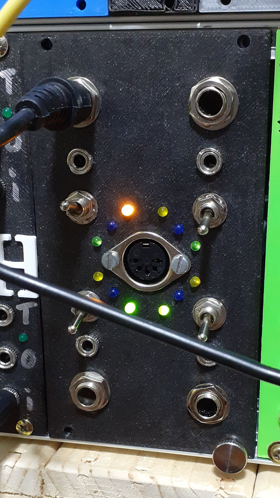

Pedal-O-Matic

Pedal-O-Matic is a quad foot pedal to CV and midi module I designed recently. I bought some analogue gear last year and a synth with 100+ knobs on it, and noticed that it is difficult if not impossible to change settings on these machines while playing with both hands.

So I bought a couple of foot / expression pedals. That worked fine but gave me limited options. Because basically the pedal ( M-Audio EX-P ) is a potentiometer, your synth has to have a special input for that. The pedal does not output a CV or any midi data. So how could I use them for other synths and digital synths?

Because of the limited possibilities the pedals themselves offer I decided to make my own pedal to CV / midi interface. And while one can not stand on 1 foot for long, I decided to make a quad version of it :wink:

You can see Pedal-O-Matic in the picture above in my 19 inch rack.

Per foot pedal there are 3 LEDs and a switch, one 6.5 mm input and one 3.5 mm output. The green and yellow LEDs signal whether the output voltage is positive or negative and they light up proportional to the voltage. The blue LED signals whether midi data is sent to the DIN connector.

The switch allows to choose between a unipolar and bipolar output voltage range, between an output voltage range from 0 V … 5 V or from -5 V … 5 V. I’ve chosen these ranges because they fit the input voltage ranges of some of my analog gear and I believe they are a euro rack standard.

One might think it would have been convenient maybe to add an atenuator to adjust the range of a pedal, but that would make the panel even bigger and a more generic solution would be to make a separate attenuation module. I went for the latter.

So how does it work?
The idea is that each foot pedal being a potentiometer basically can act as a voltage divider. So I choose to use a voltage reference of 5V, the LT1021 as a reference. All foot pedals are connected to its 5V end. Given that I wanted a voltage range from 0 to 5 Volts, the circuit could have been very simple from here. Add an output and we would have been set!

But adding the option of a range of -5V to +5V made things a bit more complicated. Have a look at the schematic. For the 0 … 5 Volt range (switch in position I) the pedal provides a voltage to the minus input of the first opamp (top left of 4) which subtracts the voltage on its minus input ( 0 … 5 V ) from the 5 V reference on its plus input. This effectively gives a 5 … 0 Volts range, which can be read from the switch as Vout.

When the switch is set to position 2, only half of the reference voltage is fed to the plus input of the opamp, so the output will be (0V … 5V) - 2.5 = -2.5 V … 2.5 V. So wiht that we are half way there. The second opamp is used as a non inverting amplifier and will multiply its input signal by 2 which gives an output range from -5 V to 5 V. Voila!

Because I like to see what happens in a module I added the opamps in the left hand part of the schematic. They are not necessary for realizing the voltage ranges, so you can leave them out. If I were to connect 2 LEDs + series resistor to the Vout point, one against the minus and one against the plus supply, then I would have seen the LEDs light up as soon as Vout is high enough to light the LEDs, which is not earlier than +2.7 Volts or -2.7 Volts (depending on the LED you use). So there would be a Vout range of -2.7V … 2.7V in which non of the LEDs would light up. What the F, I hear you cry out! Obviously, we can’t have that!

So I added the two extra opamps (with 4 of them in a TL074, this requires one chip per pedal). What they do is they take Vout as input and a voltage set by a trim pot, so that the green LED lights up as soon as Vout gets higher than 0 Volts (by adding exactly the 2.7 Volts needed to light up the LED) and the yellow LED lights up as soon as Vout goes below zero Volts. When calibrated these opamps take care of a smooth transition of the light of the LEDs around 0 Volts ( about the pedals center position ).

So, what is it with all the diodes in the schematic? The diodes allow the arduino to light up the LEDs (irrespective of the foot pedal’s position). This I’ve added to make it possible at startup of the module to let the arduino blink the LEDs so that I know they are all in working order. Who doesn’t like a bit of a light show?

The midi part is relatively simple. The arduino reads the foot pedal´s position via A0…A3. It then sends a midi controller value to the DIN connector via its TX output. The code can be found in this github project. The main trick of the sofware is to use the ResponsiveAnalogRead.h code, which smooths the analog input values and gets rid of numerical noise so that the arduino only sends out midi values if a pedal changes its position.

The pedals use 6.5 mm jacks, therefor the inputs are 6.5 mm stereo jacks. Given that my synths have 3.5 mm jacks I’m using mini jacks for CV outputs. If no pedal is present a 100k resistor keeps the CV value and midi output at a fixed value. Midi values are only send when the pedal changes position.

I used a proto board to build the module. The type I use makes it easy to use ICs and supplies copper tracks around the board that can be used for GND, +12V and -12V. Because there are 4 x 4 opamps involved, 2 x 4 jacks, 4 switches, 12 LEDs there are quite a few connections to be made.

The midi output of the module is controller 20 … 23 for footpedal 1 … 3, each on their own midi channel (1 … 4).

| pedal number | midi channel | controller number |
| ------------ | ------------ | ----------------- |
| pedal-1 | 1 | 20 |
| pedal-2 | 2 | 21 |
| pedal-3 | 3 | 22 |
| pedal-4 | 4 | 23 |

Midi channels can be easily rerouted via a sequencer, so the fact that they are set to a fixed value in the software should not be a problem. But what about the controller values I chose?

Given that some synths want e.g. a controller 19 for the cutoff frequency of their filter and I thought it would become too complicated to allow the user to set the value of the controllers from the front panel, I decided being a user of Ableton, to try and make a controller remap patch. I’m currently working on one in Max for Live (my 1st patch for Max), and will add it to the Pedal-O-Matic repository as soon as it is ready.

This project contains schematics in KiCad format.
As stated earlier, the LEDs are not essential and can be left out. That will save 2 opamps, the transistors and a few diodes. Then the TL074 could be replaced with one TL072 per foot pedal, obviously you will have to change the pin numbers of the opamps then.

The code was written for an Arduino Nano, but should run on most Arduinos.

The STL-file for a euro rack format panel can be found in the 3D directory.

Included is a MaxForLive patch for Ableton Live that will make it possible to change the controller number of a midi controller message into another number. This makes it easy to use the output of Pedal-O-Matic for all kinds of devices responding to specific controller numbers other than 20 ... 23.
